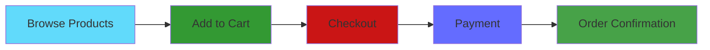

<div align="center">

<!-- Animated Header -->


<h3>🛍️ Modern Full-Stack Fashion E-Commerce Platform 🛍️</h3>

<p align="center">
  
</p>

<!-- Badges -->
<p align="center">
  
  
  
  
  
</p>

<p align="center">
  
  
  
</p>

<p align="center">
  <a href="#-features">Features</a> •
  <a href="#-demo">Demo</a> •
  <a href="#-installation">Installation</a> •
  <a href="#-tech-stack">Tech Stack</a> •
  <a href="#-screenshots">Screenshots</a> •
  <a href="#-api">API</a> •
  <a href="#-contributing">Contributing</a>
</p>

<!-- Project Banner -->


</div>

---

## 📖 About The Project

**Ashion** is a cutting-edge, full-featured e-commerce platform designed specifically for the fashion industry. Built with modern web technologies, it delivers a seamless shopping experience with lightning-fast performance, beautiful UI, and robust functionality.

### 🎯 Why Choose Ashion?

<table>
<tr>
<td>

**🎨 Modern Design**
- Clean, intuitive interface
- Smooth animations
- Responsive across all devices
- Premium user experience

</td>
<td>

**⚡ High Performance**
- Built with Vite
- Optimized bundle size
- Fast page loads
- Efficient rendering

</td>
</tr>
<tr>
<td>

**🔒 Secure & Reliable**
- JWT authentication
- Secure checkout
- Data validation
- Error handling

</td>
<td>

**📊 Admin Dashboard**
- Sales analytics
- Product management
- Order tracking
- Customer insights

</td>
</tr>
</table>

---

## ✨ Features

<div align="center">

### 🛍️ Customer Experience

</div>



<details>
<summary>🔍 <b>Product Browsing</b></summary>

- 📱 Browse by category (Men's, Women's, All Products)
- 🔎 Advanced search functionality
- 🏷️ Filter by price, size, color
- ⭐ Product ratings and reviews
- 📸 High-quality product images
- 💡 Product recommendations

</details>

<details>
<summary>🛒 <b>Shopping Cart</b></summary>

- ➕ Add/remove products easily
- 🔢 Update quantities in real-time
- 💾 Persistent cart (localStorage)
- 💰 Live price calculations
- 🎁 Apply discount codes
- 📦 Free shipping over ₹1000

</details>

<details>
<summary>💳 <b>Checkout System</b></summary>

- 📋 Multi-step checkout process
- 📝 Billing information form
- 💳 Multiple payment methods:
  - Cash on Delivery (COD)
  - Credit/Debit Card
  - UPI Payment
- ✅ Form validation
- 📧 Order confirmation email
- 🧾 Invoice generation

</details>

<details>
<summary>👤 <b>User Account</b></summary>

- 🔐 Secure registration & login
- 👨‍💼 Profile management
- 📜 Order history
- ❤️ Wishlist functionality
- 📍 Saved addresses
- 🔔 Notifications

</details>

<div align="center">

### 👨‍💼 Admin Features

</div>

<details>
<summary>📊 <b>Dashboard & Analytics</b></summary>

- 📈 Sales analytics with charts
- 💵 Revenue tracking
- 📦 Order statistics
- 👥 Customer insights
- 📊 Product performance
- 🎯 Conversion rates

</details>

<details>
<summary>📦 <b>Product Management</b></summary>

- ➕ Add new products
- ✏️ Edit product details
- 🗑️ Delete products
- 📸 Image upload
- 📊 Inventory management
- 🏷️ Category management

</details>

<details>
<summary>🚚 <b>Order Management</b></summary>

- 📋 View all orders
- 🔄 Update order status
- 📦 Track deliveries
- 🧾 Generate invoices
- 📧 Send notifications
- 📊 Order analytics

</details>

---

## 🎨 Demo

<div align="center">

### 🌐 Live Demo

**Coming Soon!** 🚀

<!-- Uncomment when deployed
[](https://your-demo-url.com)
-->

</div>

---

## 🛠️ Tech Stack

<div align="center">

### Frontend Technologies

<table>
<tr>
<td align="center" width="96">

<br>React
</td>
<td align="center" width="96">

<br>Vite
</td>
<td align="center" width="96">

<br>JavaScript
</td>
<td align="center" width="96">

<br>HTML5
</td>
<td align="center" width="96">

<br>CSS3
</td>
</tr>
</table>

### Backend Technologies

<table>
<tr>
<td align="center" width="96">

<br>Node.js
</td>
<td align="center" width="96">

<br>Express
</td>
<td align="center" width="96">

<br>MongoDB
</td>
<td align="center" width="96">

<br>npm
</td>
<td align="center" width="96">

<br>Git
</td>
</tr>
</table>

</div>

---

## 📸 Screenshots

<div align="center">

### 🏠 Home Page


### 🛍️ Product Detail


### 🛒 Shopping Cart


### 💳 Checkout


### 📊 Admin Dashboard


</div>

---

## 💻 Installation

<div align="center">

### 🚀 Quick Start Guide

</div>

### Prerequisites

Make sure you have these installed:

```bash
Node.js >= 20.x
npm >= 10.x
MongoDB >= 7.0
Git
```

### 📥 Clone Repository

```bash
git clone https://github.com/ashiii2121/finale-project.git
cd finale-project
```

### 📦 Install Dependencies

**Frontend:**
```bash
npm install
```

**Backend:**
```bash
cd backend
npm install
```

### ⚙️ Environment Setup

Create `.env` file in `backend` directory:

```env
# Server Configuration
PORT=5000
NODE_ENV=development

# Database
MONGODB_URI=mongodb://127.0.0.1:27017/ashion

# JWT Secret
JWT_SECRET=your-super-secret-jwt-key

# Client URL
CLIENT_URL=http://localhost:5173
```

### 🗄️ Start MongoDB

**Windows:**
```bash
net start MongoDB
```

**macOS/Linux:**
```bash
sudo systemctl start mongod
```

**Docker:**
```bash
docker run -d -p 27017:27017 --name mongodb mongo:latest
```

### 🌱 Seed Database (Optional)

```bash
cd backend
npm run seed
```

### ▶️ Run Application

**Terminal 1 - Frontend:**
```bash
npm run dev
```
🌐 Frontend: http://localhost:5173

**Terminal 2 - Backend:**
```bash
cd backend
npm run dev
```
🔌 Backend: http://localhost:5000

---

## 📁 Project Structure

```
finale-project/
│
├── 📂 public/                    # Static assets
│   ├── img/                      # Images
│   ├── css/                      # Global styles
│   └── js/                       # Global scripts
│
├── 📂 src/                       # Frontend source
│   ├── 📂 admin/                 # Admin panel
│   │   ├── AdminDashboard.jsx
│   │   ├── ProductsManagement.jsx
│   │   ├── OrdersManagement.jsx
│   │   ├── CustomersManagement.jsx
│   │   └── Analytics.jsx
│   │
│   ├── 📂 components/            # Reusable components
│   │   ├── Header.jsx
│   │   ├── Footer.jsx
│   │   ├── Products.jsx
│   │   └── Trend.jsx
│   │
│   ├── 📂 pages/                 # Page components
│   │   ├── HomePage.jsx
│   │   ├── ShopPage.jsx
│   │   ├── ProductDetailPage.jsx
│   │   ├── CartPage.jsx
│   │   ├── CheckoutPage.jsx
│   │   ├── MensPage.jsx
│   │   ├── WomensPage.jsx
│   │   └── WishlistPage.jsx
│   │
│   ├── 📂 context/               # Context providers
│   │   ├── CartContext.jsx
│   │   └── WishlistContext.jsx
│   │
│   ├── 📂 hooks/                 # Custom hooks
│   │   ├── useCart.js
│   │   └── useWishlist.js
│   │
│   ├── 📂 services/              # API services
│   │   ├── productService.js
│   │   └── authService.js
│   │
│   ├── App.jsx                   # Main app
│   └── main.jsx                  # Entry point
│
├── 📂 backend/                   # Backend source
│   ├── 📂 config/                # Configuration
│   │   └── database.js
│   │
│   ├── 📂 models/                # Database models
│   │   ├── Product.js
│   │   ├── User.js
│   │   └── Order.js
│   │
│   ├── 📂 routes/                # API routes
│   │   ├── products.js
│   │   ├── users.js
│   │   └── orders.js
│   │
│   ├── 📂 middleware/            # Middleware
│   │   └── auth.js
│   │
│   ├── server.js                 # Server entry
│   └── seed.js                   # Database seeder
│
├── 📄 package.json               # Dependencies
├── 📄 vite.config.js             # Vite config
├── 📄 .gitignore                 # Git ignore
├── 📄 LICENSE                    # MIT License
└── 📄 README.md                  # This file
```

---

## 🔌 API Documentation

<div align="center">

### Base URL
```
http://localhost:5000/api/v1
```

</div>

### 🔐 Authentication

| Method | Endpoint | Description | Auth |
|--------|----------|-------------|------|
| POST | `/auth/register` | Register new user | ❌ |
| POST | `/auth/login` | User login | ❌ |
| POST | `/auth/logout` | User logout | ✅ |
| GET | `/auth/me` | Get current user | ✅ |

### 📦 Products

| Method | Endpoint | Description | Auth |
|--------|----------|-------------|------|
| GET | `/products` | Get all products | ❌ |
| GET | `/products/:id` | Get single product | ❌ |
| POST | `/products` | Create product | 👨‍💼 Admin |
| PUT | `/products/:id` | Update product | 👨‍💼 Admin |
| DELETE | `/products/:id` | Delete product | 👨‍💼 Admin |

### 🛒 Orders

| Method | Endpoint | Description | Auth |
|--------|----------|-------------|------|
| GET | `/orders` | Get all orders | 👨‍💼 Admin |
| GET | `/orders/:id` | Get single order | ✅ |
| POST | `/orders` | Create order | ✅ |
| PUT | `/orders/:id` | Update order | 👨‍💼 Admin |

---

## 🤝 Contributing

Contributions make the open-source community amazing! Any contributions you make are **greatly appreciated**.

<div align="center">

### 🌟 How to Contribute

</div>

1. **Fork the Project**
2. **Create your Feature Branch**
   ```bash
   git checkout -b feature/AmazingFeature
   ```
3. **Commit your Changes**
   ```bash
   git commit -m 'Add some AmazingFeature'
   ```
4. **Push to the Branch**
   ```bash
   git push origin feature/AmazingFeature
   ```
5. **Open a Pull Request**

---

## 📝 License

<div align="center">

Distributed under the **MIT License**. See `LICENSE` for more information.

[](https://opensource.org/licenses/MIT)

</div>

---

## 👨‍💻 Author

<div align="center">

### Ashik

[](https://github.com/ashiii2121)
[](https://linkedin.com/in/yourprofile)
[](https://yourportfolio.com)
[](mailto:your.email@example.com)

</div>

---

## 🙏 Acknowledgments

<div align="center">

Special thanks to all the amazing resources and tools:

- [React](https://reactjs.org/) - UI Library
- [Vite](https://vitejs.dev/) - Build Tool
- [MongoDB](https://www.mongodb.com/) - Database
- [Express](https://expressjs.com/) - Backend Framework
- [Font Awesome](https://fontawesome.com/) - Icons
- [Shields.io](https://shields.io/) - Badges
- [Skill Icons](https://skillicons.dev/) - Tech Stack Icons

</div>

---

## 📊 GitHub Stats

<div align="center">


</div>

---

## 🗺️ Roadmap

- [x] ✅ Basic e-commerce functionality
- [x] ✅ Shopping cart system
- [x] ✅ Checkout process
- [x] ✅ Admin dashboard
- [x] ✅ Responsive design
- [ ] 🔄 User reviews and ratings
- [ ] 🔄 Advanced product search
- [ ] 🔄 Payment gateway integration
- [ ] 🔄 Email notifications
- [ ] 🔄 Order tracking system
- [ ] 🔄 Wishlist sharing
- [ ] 🔄 Social media integration
- [ ] 🔄 Multi-language support
- [ ] 🔄 PWA support

---

## 📞 Support

<div align="center">

### Need Help?

[](https://github.com/ashiii2121/finale-project/issues)
[](https://github.com/ashiii2121/finale-project/discussions)

</div>

---

<div align="center">

## ⭐ Star History

[](https://star-history.com/#ashiii2121/finale-project&Date)

---

### 💖 Show Your Support

**Give a ⭐ if this project helped you!**

---


**© 2025 Ashion E-Commerce. All rights reserved.**

**Made with ❤️ by [Ashik](https://github.com/ashiii2121)**

</div>
